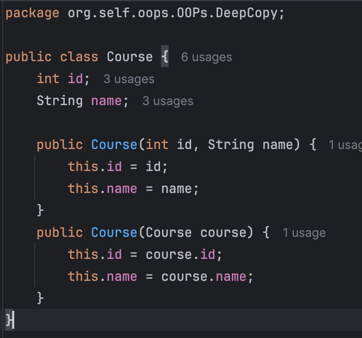
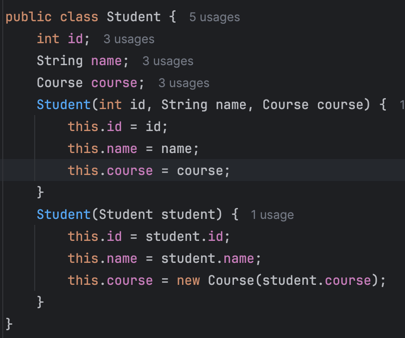
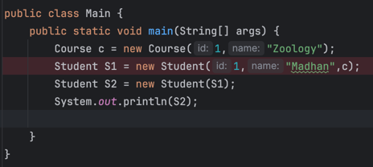
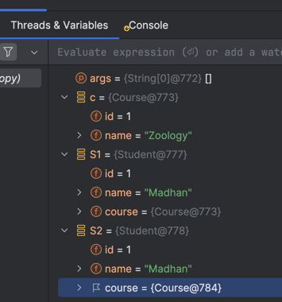
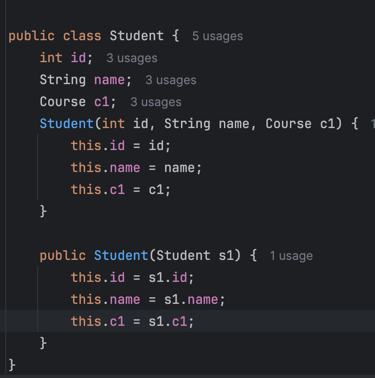
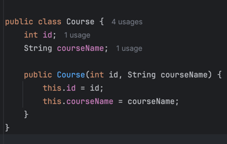
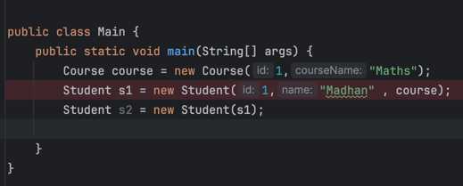
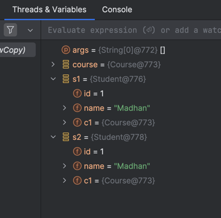
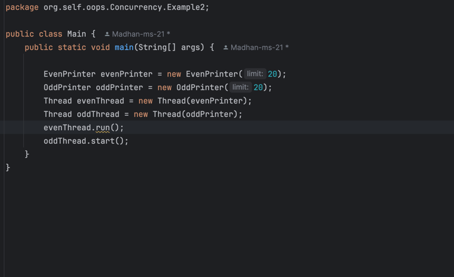
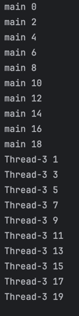

# OOPS In Java

OOP stands for Object-Oriented Programming, a 
programming paradigm based on the concept of "objects."
Objects are instances of classes, which are blueprints
for creating objects. OOP focuses on using objects to
represent real-world entities, enabling more modular,
reusable, and organized code.

### Reference Documentation
## key concepts of OOP

### Class
Blue Print of an Object(Entity)
### Object
Object/Entity is an Instance of class. It Occupies memory.

## Core Concepts

There are 3 Pillars and 1 Principle of OOPS

### Principle
- Abstraction
  - 
    - Abstraction tells us to envision complex system in terms of 
        Ideas/Entities.
    - Ex: When Designing an Ecommerce Application, Simplify the 
          complexity by envisoning the complex system into entities
          like users , Products, Orders , Payments , Carts , Ratings etc.
    - We dont want to Know the inner details of each entity 
          We hide the complexity behind each Entity , Rather we simply 
        the system in terms of Entities
    - As a Summary Abstraction tells us to Envision the system 
  in terms of entities/ Ideas hiding the complex details.

### Pillars
- Encapsulation
  - 
  - Holding Attributes and Methods of an Entity together (via Class)
  - Protects Attributes and Behaviours from Outside (access Modifiers)
  - ### Access Modifiers
    - [Private]() : The member is only
      accessible within the class No other
      code outside the class can access.
      that member
    - [Default]() : Any class within package can access
      this member . To use this access Modifier don't write anything
      before the member declaration
    - [Protected]() : Protected members can be accessed by any class within the same package.
      also  Protected members can also be accessed by subclasses, even if they are
     in different packages. But Not Accessible from Unrelated Classes Protected
     members cannot be accessed directly from classes that are not in the same package and do not 
      inherit from the class with the protected members.
    - [Public]() : Most lenient access modifier , A public member can be accessed
      from anywhere
- Inheritance
  - 
- ## Polymorphism
  - Compile Time Polymorphism
    - It is Achieived By Method Overloading
    - Method overloading allows us to
      create multiple methods with
      same name different method
      signature in a class
    - Examples of Different Signatures : 
      - Print() Print(int t) Print(string s) Print(string s , String t)
    - Because compiler can detect the
      different parameters and tell which
      method to be called . so this is
      compile time polymorphism
  - Run Time Polymorphism
    - Acheived by Method Overriding

## Constructors

A class has multiple attributes which needs to be initialized when an
object is created.

A constructor is a special method used to initialize attributes of a class
When a object is created using new keyword a constructor is called.
Types:
- Default
  - This constructor is given by java when we have not defined our constructor.
  - In a default constructor all the attributes of a class are set to
    their default value as per their data types
  - int - 0 , float/double - 0.0 , bool - false , char - '' , string - null , custom object - null
- No Args
  - This is a custom constructor that is
    added by the developer. 
  - As per the name this constructor doesn't
    takes any arguments It is mostly
    used to initialize an object with
    custom default values
  - **_Note :_** Whenever you create a custom
    constructor java compiler won't give you
    a default constructor.
- Paramterized
  - These Constructors can take multiple
    parameters
- Copy constructor
  - A copy constructor is a special constructor in a class that initializes a new object as a copy of an existing object. It creates a new instance of a 
  class by copying the values of the attributes from another instance of the same class. This is particularly
  useful in situations where you want to create a new object with the same state as 
  an existing object without affecting the original.
   
  - Types of Copy
    - Deep copy
      - A deep copy creates a new object and recursively copies all objects found in the original object. This means that the copied object and the original object 
      do not share any references to the same sub-objects.
     
      Example : 
    
      - Classes  
      
      - Main Method 
      - Output 
      - In the above output we can see difference in objects of Course for 
        both student Objects.
    - Shallow Copy
      - Shallow copy means all the non primitive inside your student
        class are same as Original class
      - Classes  
      - Main Method 
      - Output 
      - When we create an object using copy constructor we have only primitives 
      are created , but objects are copied.
      - As we can see we have course object at reference @773 and 
      object of student class  S1 at reference @776 with course object as above one
      So when we want to create a new object S2 of student class
      which is copy of S1 the object got created at reference @778 but 
      course object is still pointing to course object reference of S1.
      - This is the Scenario of Shallow copy.
### Memory management:
  - Memory Management in Java is a critical aspect of the Java programming language and its runtime environment.
  - It involves the allocation, usage, and deallocation of memory during the lifecycle of Java applications.
  - Stack : Each thread in a process is stored in stack space
    - Primitives are stored directly in stack
    - Objects are stored in heap and their address is stored in stack.
  - Heap Memory:
    - This is where objects and their associated instance variables are stored. 
    - The heap is created when the JVM starts and can grow or shrink dynamically.
  - ## **Note :**  Java is Pass By Value

# Process
  - code : Set of Instructions
  - Program : Compiled Code
### Process : A process is a fundamental concept in operating systems, representing a program in execution
When we start running a program
process is created for it. Process is an instance
of a program

How does Os manages Multiple Process?

If an OS has multiple processes to
run then os will schedule processes
to run as per CPU scheduling algorithm

1. FCFS(First come First Serve)
2. Round Robin etc.

Process control block
A Process Control Block (PCB) is a data structure used by the operating system
to store all the information about a specific process. 
It serves as a repository for the process's state and 
control information, enabling the OS to manage processes effectively. 
Each process has its own PCB, which is created when the process is initialized and deleted when the process terminates.

Key Components of a Process Control Block
Process Identification:

1. Process ID (PID): A unique identifier for the process.
2. Parent Process ID (PPID): The ID of the parent process, if applicable.
3. Process State: The current state of the process (e.g., New, Ready, Running, Waiting, Terminated).

4. Program Counter: Indicates the next instruction to be executed in the process.

5. CPU Registers: A set of registers that hold temporary data for the process, including general-purpose registers and status registers.

6. Memory Management Information:

7. Base and Limit Registers: Used to define the process's memory boundaries.
8. Page Tables: Information related to the virtual memory of the process.
9. Scheduling Information: Data relevant for the scheduling of the process, including priority, scheduling queue pointers, and CPU time used.

10. I/O Status Information: Information about I/O devices allocated to the process and their status.

11. Process Privileges: Information about the privileges associated with the process, determining what resources the process can access.

12. Accounting Information: Data related to resource usage, such as CPU time used, memory allocated, and other resource metrics.

### Role of the PCB in Process Management

- Context Switching: When the operating system switches the CPU from one process to another, it saves the context of the currently running process (i.e., its state, program counter, registers, etc.) in its PCB. It then loads the context of the next process from its PCB, allowing for seamless execution.

- Resource Management: The PCB helps the OS manage resources allocated to the process, ensuring that the process receives the necessary CPU time and memory.

- Process Scheduling: The information in the PCB allows the scheduler to make decisions about which process to run next based on priority, state, and other factors.

- Process Termination: Upon termination, the PCB holds the exit status of the process and is used for cleanup activities, such as deallocating resources.

### Concurrency
Concurrency refers to the ability of a system to manage multiple tasks at the same time. 
It doesn't necessarily mean that the tasks are being executed 
simultaneously; rather, they can make progress independently and
may be interleaved.

### Parallelism
Parallelism, refers to the actual simultaneous execution of multiple tasks. 
This is typically achieved on multi-core processors, 
where different cores can execute different threads or processes at the same time.

## Thread
A thread is the smallest unit of processing that can be scheduled by an operating system. It is a lightweight process that shares resources such
as memory and file handles with 
other threads in the same process, allowing for 
concurrent execution
### Thread.start()
- Purpose: The start() method is used to begin the execution of a new thread.
- Behavior: When you call start(), a new thread is created, and the run() method is invoked in that new thread. This means that the start() method does not block the current thread; both the current thread and the new thread will execute concurrently.
- Thread State: When start() is called, the thread transitions from the NEW state to the RUNNABLE state, which allows the thread scheduler to manage it.

### Thread.run()
  - Purpose: The run() method contains the code that defines the thread's task.
  - Behavior: When you call run() directly, it does not create a new thread. Instead, it executes the code within the run() method in the context of the current thread. This means that the current thread will block until the run() method completes.
  - Thread State: When run() is called, the thread does not change its state; it remains in the state of the calling thread.

In the below Example you can see when thread.run() is called it 
runs in the current thread rather creating a new thread that is shown 
there by priniting the thread name.

Output

# Executors and Callables

Executors framework and the Callable interface are part of the Java Concurrency API. 
They allow you to manage and execute asynchronous tasks in a more structured way compared to using threads directly

### Callable Interface
The Callable interface is similar to Runnable, but it can return a result and throw checked exceptions. 
This makes it more flexible for tasks that need to produce a value or handle exceptions.

Key Points:
  - Return Type: Callable has a generic return type. You can specify what type it returns when you implement the interface.
  - Checked Exceptions: Unlike Runnable, Callable can throw checked exceptions, making it suitable for tasks that might fail.

### Executors
The Executors class provides factory methods for creating thread pools and managing asynchronous task execution. You can submit tasks to an executor service, which handles the threading for you.

Key Points:
- Thread Pool Management: You don't have to manage threads manually; the executor service handles the lifecycle of threads.
- Task Submission: You can submit Callable and Runnable tasks to the executor for execution.
- Future: When you submit a Callable, you receive a Future object that can be used to retrieve the result of the computation or check its status.

#### Benefits of Using Executors and Callables

- Simplicity : You don't need to manage threads directly. The executor service takes care of thread creation, reuse, and lifecycle management.
- Asynchronous Execution: Allows for concurrent execution of tasks, which can improve performance in I/O-bound or CPU-bound applications.
- Result Handling: Callable provides a way to return results and handle exceptions more effectively compared to Runnable.

* [Official Apache Maven documentation](https://maven.apache.org/guides/index.html)
* [Spring Boot Maven Plugin Reference Guide](https://docs.spring.io/spring-boot/3.3.4/maven-plugin)
* [Create an OCI image](https://docs.spring.io/spring-boot/3.3.4/maven-plugin/build-image.html)

### Maven Parent overrides

### Link

[LLD](https://github.com/ashishps1/awesome-low-level-design)

